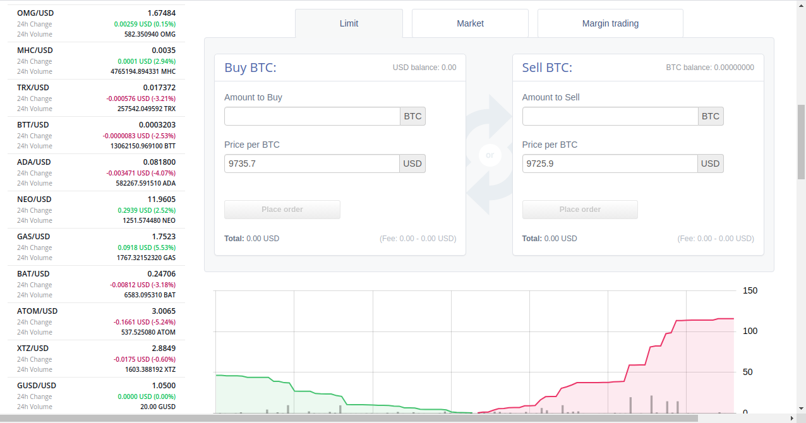
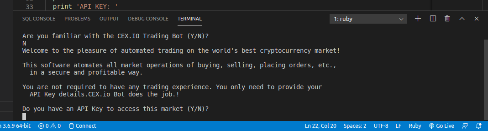
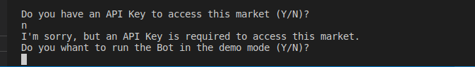
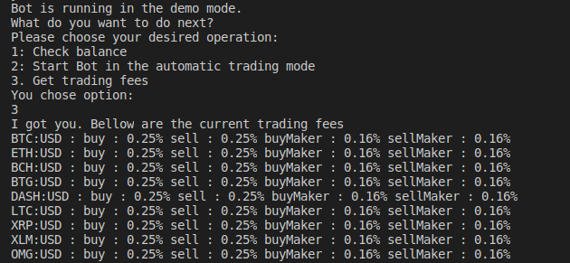
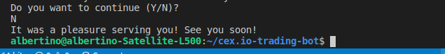

# CEX.io Trading Bot

> CEX.io Trading Bot is an online trading software that connects user to his or her CEX.io trading account via CEX.io API and performs trading of cryptocurrencies automatically on the CEX.io platform.

This bot version, developed in Ruby, meets the requirements of my Ruby Capstone Project in the Microverse Main Curriculum. 

However, the project is still under development. Therefore, caution is advised while using it in a real trading account. 

## Built With

- Ruby,
- Git, Github
- RSpec
- Gitflows

## Live Demo

[Live Demo Link](https://github.com/Albertino2020/cex.io-trading-bot/)

## Getting Started

To get a local copy up and running follow these simple example steps.

### Prerequisites

As prerequisites, you must have:

Access to the command line.

Git installed, configured, and running on your local machine. To download, install, and run Git on your local machine, please access https://git-scm.com/book/en/v2/Getting-Started-Installing-Git.

Ruby installed, configured, and running on your local machine. To download, configure, and run Ruby on your local machine, please access https://www.ruby-lang.org/en/downloads/.

### Setup
Open your command line:

There are varying ways of accessing the command line, depending on what operating system you use. If you are not familiar with the command line or just want to get further information, please access the following link: https://towardsdatascience.com/a-quick-guide-to-using-command-line-terminal-96815b97b955.

While in the command prompt, type 'cd' and press ENTER to make sure you are in the root directory.

type 'git clone https://github.com/Albertino2020/cex.io-trading-bot.git' and press ENTER, to copy the program to your local machine.
screenshot

type 'cd cex.io-trading-bot' and press ENTER, to go to the CEX.io Bot folder in your local machine.

Type 'bin/main.rb' and press ENTER to run the Bot.

How to Use the Bot

### Usage

Follow the instructions presented above to set up and run the bot on your local machine.

When prompted, follow instructions on the screen.

### Run tests

## Author

👤 Albertino Francisco

- Github: [@Albertino2020](https://github.com/Albertino2020)
- Twitter: [@albertino2050](https://twitter.com/albertino2050)
- Linkedin: [Albertino Francisco, PhD](https://linkedin.com/in/boamorte)

## 🤝 Contributing

Contributions, issues and feature requests are welcome!

Feel free to check the [issues page](issues/).

## Show your support

Give a ⭐️ if you like this project!

## Acknowledgments

- I give credit to the ASD whose I borrowed part of the CEX.io API access code that was used in this project.

## 📝 License

This project is [MIT](lic.url) licensed.
